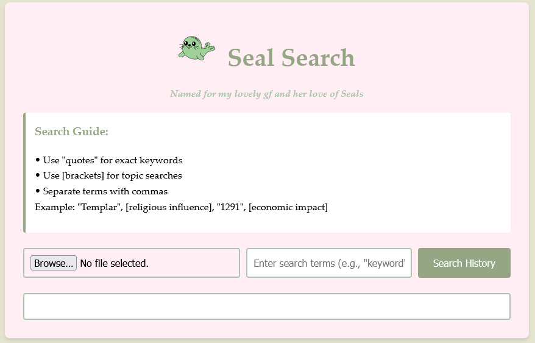

# Seal Search

## Overview

Seal Search is a simple PDF searching tool to help you quickly find all relevant information across documents. This uses Google's Gemini AI and PDF parsing to search PDFs for exact keywords or broader topics, hopefully making research and information gathering easy.

## 🌟 Features

- **Powerful PDF Search**: Search any PDF for keywords or topics
- **Query Syntax**: Search for exact phrases and/or broad topics in a single search
- **Instant Results**: 30 seconds of processing at most to get your search back
- **Web-Based**: No installation needed - works directly in your browser

## 🚀 Getting Started

### Access the Tool

Use Seal Search at: [https://seal-search.vercel.app/](https://seal-search.vercel.app/)

### How to Use

1. Upload your PDF document(s)
2. Enter your search terms using the guide below
3. View highlighted matches and relevant excerpts
4. Copy or use results as needed

### Search Guide

- Use `"quotes"` for exact keywords
- Use `[brackets]` for topic searches  
- Separate terms with commas  
- Example: `"Templar", [religious influence], "1291", [economic impact]`

## 💻 Technologies Used

- HTML
- CSS
- JavaScript
- Google Gemini AI
- Vercel (Hosting)

## 🤝 Contributing

Interested in enhancing Seal Search? Here's how:

1. Fork the repository
2. Create your feature branch (`git checkout -b feature/YourFeature`)
3. Commit your changes (`git commit -m 'Add some feature'`)
4. Push to the branch (`git push origin feature/YourFeature`)
5. Open a Pull Request

## 🙏 Acknowledgements

- [Google Gemini](https://ai.google.dev/)
- [Vercel](https://vercel.com/)

## 📬 Contact

GitHub: [Yeti-Owner](https://github.com/Yeti-Owner)

Project Link: [https://github.com/Yeti-Owner/Clio-Search](https://github.com/Yeti-Owner/Clio-Search)

**Created for easier research and discovery**
